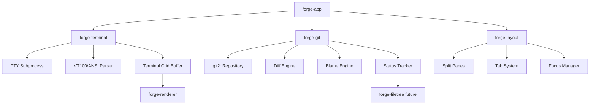

# Forge Phase 3: Terminal + Git Integration — Exhaustive Implementation Plan

> **Mission:** Add an embedded terminal emulator and full git integration, turning Forge from an editor into a development environment.

---

## Prerequisites

- ✅ Phase 1: Core engine (rope buffer, transactions, history tree)
- ✅ Phase 2: Syntax highlighting (tree-sitter integration)
- ⚠️  GPU rendering must be functional (wgpu pipeline) before terminal output is visible

---

## Architecture Overview



---

## Proposed Changes

### Phase 3.1: forge-terminal — Embedded Terminal Emulator

#### Crate Structure

```
crates/forge-terminal/
├── Cargo.toml
├── src/
│   ├── lib.rs               # Public API
│   ├── pty.rs               # PTY process management
│   ├── grid.rs              # Terminal cell grid buffer
│   ├── ansi.rs              # ANSI/VT100 escape sequence parser
│   ├── terminal.rs          # Terminal state machine
│   ├── input.rs             # Keyboard → terminal input encoding
│   └── shell.rs             # Shell detection and configuration
```

---

#### [NEW] Cargo.toml

```toml
[package]
name = "forge-terminal"
version.workspace = true
edition.workspace = true

[dependencies]
forge-core = { path = "../forge-core" }
forge-renderer = { path = "../forge-renderer" }

# Terminal emulation
alacritty_terminal = "0.24"

# PTY (platform-specific)
[target.'cfg(windows)'.dependencies]
conpty = "0.5"              # Windows ConPTY API

[target.'cfg(unix)'.dependencies]
rustix = { version = "0.38", features = ["pty", "termios"] }

# Async
tokio = { version = "1", features = ["io-util", "process", "sync", "rt"] }

# Logging
tracing = { workspace = true }

anyhow = { workspace = true }
thiserror = { workspace = true }
```

---

#### [NEW] lib.rs

```rust
//! forge-terminal: Embedded terminal emulator
//!
//! Provides a fully-featured terminal emulator using alacritty_terminal
//! for VT100/ANSI parsing and PTY management.

mod pty;
mod grid;
mod ansi;
mod terminal;
mod input;
mod shell;

pub use terminal::{Terminal, TerminalConfig, TerminalEvent};
pub use grid::{Cell, CellFlags, TerminalGrid};
pub use shell::Shell;
```

---

#### [NEW] terminal.rs — Core Terminal State Machine

**Key design decisions:**
- Use `alacritty_terminal` for battle-tested VT100 parsing
- Manage PTY subprocess lifecycle
- Emit events for rendering (content changed, bell, title change, etc.)
- Support resize (SIGWINCH on Unix, ConPTY resize on Windows)

```rust
use alacritty_terminal::term::{Term, Config as TermConfig, SizeInfo};
use alacritty_terminal::event::{Event as AlacrittyEvent, EventListener};
use alacritty_terminal::tty::{self, Pty, Options as PtyOptions};
use std::sync::{Arc, Mutex};
use tokio::sync::mpsc;
use anyhow::Result;

pub struct TerminalConfig {
    pub shell: String,
    pub args: Vec<String>,
    pub env: Vec<(String, String)>,
    pub rows: u16,
    pub cols: u16,
    pub scrollback_lines: usize,
}

impl Default for TerminalConfig {
    fn default() -> Self {
        Self {
            shell: Shell::detect().path().to_string(),
            args: vec![],
            env: vec![],
            rows: 24,
            cols: 80,
            scrollback_lines: 10_000,
        }
    }
}

#[derive(Debug, Clone)]
pub enum TerminalEvent {
    /// Terminal content changed — re-render
    ContentChanged,
    /// Terminal title changed
    TitleChanged(String),
    /// Bell character received
    Bell,
    /// Process exited
    Exited(i32),
}

pub struct Terminal {
    /// The alacritty terminal emulator
    term: Arc<Mutex<Term<EventProxy>>>,
    /// PTY handle
    pty: Pty,
    /// Event channel
    event_rx: mpsc::UnboundedReceiver<TerminalEvent>,
    /// Size info
    size: SizeInfo,
    /// Whether the terminal process is alive
    alive: bool,
}

impl Terminal {
    /// Create and spawn a new terminal
    pub fn new(config: TerminalConfig) -> Result<Self> {
        let size = SizeInfo::new(
            config.cols as f32 * 8.0,  // cell width placeholder
            config.rows as f32 * 16.0, // cell height placeholder
            8.0,   // cell width
            16.0,  // cell height
            0.0,   // padding x
            0.0,   // padding y
        );

        let (event_tx, event_rx) = mpsc::unbounded_channel();
        let event_proxy = EventProxy(event_tx);

        let term_config = TermConfig::default();
        let term = Term::new(term_config, &size, event_proxy);
        let term = Arc::new(Mutex::new(term));

        let pty_options = PtyOptions {
            shell: Some(tty::Shell::new(config.shell, config.args)),
            ..Default::default()
        };
        let pty = tty::new(&pty_options, size.into(), None)?;

        Ok(Self {
            term,
            pty,
            event_rx,
            size,
            alive: true,
        })
    }

    /// Write input to the terminal (keyboard input)
    pub fn write(&mut self, input: &[u8]) -> Result<()> {
        use std::io::Write;
        self.pty.writer().write_all(input)?;
        Ok(())
    }

    /// Resize the terminal
    pub fn resize(&mut self, rows: u16, cols: u16) {
        self.size = SizeInfo::new(
            cols as f32 * 8.0,
            rows as f32 * 16.0,
            8.0, 16.0, 0.0, 0.0,
        );
        self.term.lock().unwrap().resize(self.size);
        self.pty.resize(self.size.into());
    }

    /// Get the terminal grid for rendering
    pub fn grid(&self) -> TerminalGrid {
        let term = self.term.lock().unwrap();
        TerminalGrid::from_term(&term)
    }

    /// Poll for events
    pub async fn next_event(&mut self) -> Option<TerminalEvent> {
        self.event_rx.recv().await
    }
}

/// Bridge between alacritty events and our event channel
struct EventProxy(mpsc::UnboundedSender<TerminalEvent>);

impl EventListener for EventProxy {
    fn send_event(&self, event: AlacrittyEvent) {
        match event {
            AlacrittyEvent::Title(title) => {
                let _ = self.0.send(TerminalEvent::TitleChanged(title));
            }
            AlacrittyEvent::Bell => {
                let _ = self.0.send(TerminalEvent::Bell);
            }
            _ => {
                let _ = self.0.send(TerminalEvent::ContentChanged);
            }
        }
    }
}
```

---

#### [NEW] grid.rs — Terminal Grid Buffer

```rust
use forge_renderer::Color;

#[derive(Debug, Clone, Copy)]
pub struct CellFlags {
    pub bold: bool,
    pub italic: bool,
    pub underline: bool,
    pub inverse: bool,
}

#[derive(Debug, Clone)]
pub struct Cell {
    pub c: char,
    pub fg: Color,
    pub bg: Color,
    pub flags: CellFlags,
}

pub struct TerminalGrid {
    pub cells: Vec<Vec<Cell>>,
    pub cursor_row: usize,
    pub cursor_col: usize,
    pub rows: usize,
    pub cols: usize,
}

impl TerminalGrid {
    /// Extract grid from alacritty Term
    pub fn from_term<T>(term: &alacritty_terminal::term::Term<T>) -> Self
    where T: alacritty_terminal::event::EventListener
    {
        let grid = term.grid();
        let rows = grid.screen_lines();
        let cols = grid.columns();

        let mut cells = Vec::with_capacity(rows);
        for row_idx in 0..rows {
            let mut row = Vec::with_capacity(cols);
            for col_idx in 0..cols {
                let cell = &grid[alacritty_terminal::index::Line(row_idx as i32)]
                    [alacritty_terminal::index::Column(col_idx)];
                row.push(Cell {
                    c: cell.c,
                    fg: ansi_to_color(cell.fg),
                    bg: ansi_to_color(cell.bg),
                    flags: CellFlags {
                        bold: cell.flags.contains(alacritty_terminal::term::cell::Flags::BOLD),
                        italic: cell.flags.contains(alacritty_terminal::term::cell::Flags::ITALIC),
                        underline: cell.flags.contains(alacritty_terminal::term::cell::Flags::UNDERLINE),
                        inverse: cell.flags.contains(alacritty_terminal::term::cell::Flags::INVERSE),
                    },
                });
            }
            cells.push(row);
        }

        let cursor = term.grid().cursor.point;
        Self {
            cells,
            cursor_row: cursor.line.0 as usize,
            cursor_col: cursor.column.0,
            rows,
            cols,
        }
    }
}

fn ansi_to_color(color: alacritty_terminal::vte::ansi::Color) -> Color {
    match color {
        alacritty_terminal::vte::ansi::Color::Named(named) => {
            match named {
                alacritty_terminal::vte::ansi::NamedColor::Black => Color::rgb(0, 0, 0),
                alacritty_terminal::vte::ansi::NamedColor::Red => Color::rgb(255, 85, 85),
                alacritty_terminal::vte::ansi::NamedColor::Green => Color::rgb(80, 250, 123),
                alacritty_terminal::vte::ansi::NamedColor::Yellow => Color::rgb(241, 250, 140),
                alacritty_terminal::vte::ansi::NamedColor::Blue => Color::rgb(98, 114, 164),
                alacritty_terminal::vte::ansi::NamedColor::Magenta => Color::rgb(255, 121, 198),
                alacritty_terminal::vte::ansi::NamedColor::Cyan => Color::rgb(139, 233, 253),
                alacritty_terminal::vte::ansi::NamedColor::White => Color::rgb(248, 248, 242),
                _ => Color::rgb(248, 248, 242),
            }
        }
        alacritty_terminal::vte::ansi::Color::Spec(rgb) => Color::rgb(rgb.r, rgb.g, rgb.b),
        alacritty_terminal::vte::ansi::Color::Indexed(idx) => Color::rgb(idx, idx, idx), // Simplified
    }
}
```

---

#### [NEW] shell.rs — Shell Detection

```rust
use std::env;

pub struct Shell {
    path: String,
    args: Vec<String>,
}

impl Shell {
    /// Detect the user's default shell
    pub fn detect() -> Self {
        #[cfg(windows)]
        {
            // Prefer PowerShell, fall back to cmd
            if let Ok(pwsh) = which::which("pwsh") {
                return Self {
                    path: pwsh.to_string_lossy().to_string(),
                    args: vec!["-NoLogo".to_string()],
                };
            }
            Self {
                path: env::var("COMSPEC").unwrap_or_else(|_| "cmd.exe".to_string()),
                args: vec![],
            }
        }
        #[cfg(unix)]
        {
            let shell = env::var("SHELL").unwrap_or_else(|_| "/bin/sh".to_string());
            Self {
                path: shell,
                args: vec!["-l".to_string()],
            }
        }
    }

    pub fn path(&self) -> &str { &self.path }
    pub fn args(&self) -> &[String] { &self.args }
}
```

---

### Phase 3.2: forge-git — Git Integration

#### Crate Structure

```
crates/forge-git/
├── Cargo.toml
├── src/
│   ├── lib.rs               # Public API
│   ├── repo.rs              # Repository wrapper
│   ├── status.rs            # Working tree status
│   ├── diff.rs              # Diff engine (inline gutter markers)
│   ├── blame.rs             # Line-by-line blame
│   ├── log.rs               # Commit log
│   ├── branch.rs            # Branch management
│   └── remote.rs            # Push/pull/fetch
```

---

#### [NEW] Cargo.toml

```toml
[package]
name = "forge-git"
version.workspace = true
edition.workspace = true

[dependencies]
forge-core = { path = "../forge-core" }

# Git
git2 = "0.19"

# Async file watching (for auto-refresh)
notify = "7"
tokio = { version = "1", features = ["sync", "rt"] }

anyhow = { workspace = true }
thiserror = { workspace = true }
tracing = { workspace = true }
```

---

#### [NEW] lib.rs

```rust
//! forge-git: Git integration for the Forge editor
//!
//! Wraps libgit2 to provide status, diff, blame, log, and branch operations.

mod repo;
mod status;
mod diff;
mod blame;
mod log;
mod branch;
mod remote;

pub use repo::Repository;
pub use status::{FileStatus, WorkingTreeStatus};
pub use diff::{DiffHunk, DiffLine, GutterMark};
pub use blame::{BlameLine, BlameInfo};
pub use log::{CommitInfo, CommitLog};
pub use branch::{Branch, BranchType};
```

---

#### [NEW] repo.rs — Repository Wrapper

```rust
use git2::Repository as Git2Repo;
use std::path::{Path, PathBuf};
use anyhow::Result;

pub struct Repository {
    repo: Git2Repo,
    workdir: PathBuf,
}

impl Repository {
    /// Open a git repository (searches parent directories)
    pub fn discover(path: &Path) -> Result<Self> {
        let repo = Git2Repo::discover(path)?;
        let workdir = repo.workdir()
            .ok_or_else(|| anyhow::anyhow!("Bare repository not supported"))?
            .to_path_buf();
        Ok(Self { repo, workdir })
    }

    /// Get the current branch name
    pub fn current_branch(&self) -> Result<String> {
        let head = self.repo.head()?;
        Ok(head.shorthand().unwrap_or("HEAD").to_string())
    }

    /// Get all local branches
    pub fn branches(&self) -> Result<Vec<Branch>> { /* ... */ }

    /// Get working tree status
    pub fn status(&self) -> Result<WorkingTreeStatus> {
        super::status::get_status(&self.repo)
    }

    /// Get diff for a specific file (gutter marks)
    pub fn diff_file(&self, path: &Path) -> Result<Vec<DiffHunk>> {
        super::diff::diff_file(&self.repo, path)
    }

    /// Get blame for a file
    pub fn blame_file(&self, path: &Path) -> Result<Vec<BlameLine>> {
        super::blame::blame_file(&self.repo, path)
    }

    /// Get commit log
    pub fn log(&self, limit: usize) -> Result<Vec<CommitInfo>> {
        super::log::get_log(&self.repo, limit)
    }

    /// Stage a file
    pub fn stage(&self, path: &Path) -> Result<()> {
        let mut index = self.repo.index()?;
        index.add_path(path)?;
        index.write()?;
        Ok(())
    }

    /// Commit staged changes
    pub fn commit(&self, message: &str) -> Result<git2::Oid> {
        let sig = self.repo.signature()?;
        let tree_id = self.repo.index()?.write_tree()?;
        let tree = self.repo.find_tree(tree_id)?;
        let parent = self.repo.head()?.peel_to_commit()?;
        let oid = self.repo.commit(
            Some("HEAD"), &sig, &sig, message, &tree, &[&parent]
        )?;
        Ok(oid)
    }
}
```

---

#### [NEW] status.rs — Working Tree Status

```rust
use git2::{Repository, StatusOptions, Status};
use std::path::PathBuf;
use anyhow::Result;

#[derive(Debug, Clone, Copy, PartialEq, Eq)]
pub enum FileStatus {
    Modified,
    Added,
    Deleted,
    Renamed,
    Untracked,
    Ignored,
    Conflicted,
}

pub struct WorkingTreeStatus {
    pub files: Vec<(PathBuf, FileStatus)>,
    pub staged: Vec<(PathBuf, FileStatus)>,
}

pub fn get_status(repo: &Repository) -> Result<WorkingTreeStatus> {
    let mut opts = StatusOptions::new();
    opts.include_untracked(true)
        .recurse_untracked_dirs(true)
        .include_ignored(false);

    let statuses = repo.statuses(Some(&mut opts))?;
    let mut files = Vec::new();
    let mut staged = Vec::new();

    for entry in statuses.iter() {
        let path = PathBuf::from(entry.path().unwrap_or(""));
        let status = entry.status();

        // Working tree changes
        if status.intersects(Status::WT_MODIFIED) {
            files.push((path.clone(), FileStatus::Modified));
        } else if status.intersects(Status::WT_NEW) {
            files.push((path.clone(), FileStatus::Untracked));
        } else if status.intersects(Status::WT_DELETED) {
            files.push((path.clone(), FileStatus::Deleted));
        }

        // Staged changes
        if status.intersects(Status::INDEX_MODIFIED) {
            staged.push((path.clone(), FileStatus::Modified));
        } else if status.intersects(Status::INDEX_NEW) {
            staged.push((path.clone(), FileStatus::Added));
        } else if status.intersects(Status::INDEX_DELETED) {
            staged.push((path.clone(), FileStatus::Deleted));
        }
    }

    Ok(WorkingTreeStatus { files, staged })
}
```

---

#### [NEW] diff.rs — Inline Diff / Gutter Marks

```rust
use git2::{Repository, DiffOptions};
use std::path::Path;
use anyhow::Result;

#[derive(Debug, Clone, Copy, PartialEq, Eq)]
pub enum GutterMark {
    Added,     // Green bar in gutter
    Modified,  // Blue bar in gutter
    Deleted,   // Red triangle in gutter
}

#[derive(Debug, Clone)]
pub struct DiffLine {
    pub line_number: usize,
    pub mark: GutterMark,
    pub content: String,
}

#[derive(Debug, Clone)]
pub struct DiffHunk {
    pub old_start: usize,
    pub old_lines: usize,
    pub new_start: usize,
    pub new_lines: usize,
    pub lines: Vec<DiffLine>,
}

pub fn diff_file(repo: &Repository, path: &Path) -> Result<Vec<DiffHunk>> {
    let mut opts = DiffOptions::new();
    opts.pathspec(path);

    let diff = repo.diff_index_to_workdir(None, Some(&mut opts))?;
    let mut hunks = Vec::new();

    diff.foreach(
        &mut |_, _| true,
        None,
        Some(&mut |_delta, hunk| {
            hunks.push(DiffHunk {
                old_start: hunk.old_start() as usize,
                old_lines: hunk.old_lines() as usize,
                new_start: hunk.new_start() as usize,
                new_lines: hunk.new_lines() as usize,
                lines: Vec::new(),
            });
            true
        }),
        Some(&mut |_delta, _hunk, line| {
            if let Some(last_hunk) = hunks.last_mut() {
                let mark = match line.origin() {
                    '+' => GutterMark::Added,
                    '-' => GutterMark::Deleted,
                    _ => GutterMark::Modified,
                };
                last_hunk.lines.push(DiffLine {
                    line_number: line.new_lineno().unwrap_or(0) as usize,
                    mark,
                    content: String::from_utf8_lossy(line.content()).to_string(),
                });
            }
            true
        }),
    )?;

    Ok(hunks)
}
```

---

#### [NEW] blame.rs — Line Blame

```rust
use git2::Repository;
use std::path::Path;
use anyhow::Result;

#[derive(Debug, Clone)]
pub struct BlameLine {
    pub line: usize,
    pub commit_id: String,
    pub author: String,
    pub date: String,
    pub summary: String,
}

pub struct BlameInfo {
    pub lines: Vec<BlameLine>,
}

pub fn blame_file(repo: &Repository, path: &Path) -> Result<Vec<BlameLine>> {
    let blame = repo.blame_file(path, None)?;
    let mut lines = Vec::new();

    for hunk in blame.iter() {
        let sig = hunk.final_signature();
        let author = sig.name().unwrap_or("Unknown").to_string();
        let commit_id = format!("{}", hunk.final_commit_id());

        for line_offset in 0..hunk.lines_in_hunk() {
            lines.push(BlameLine {
                line: hunk.final_start_line() + line_offset,
                commit_id: commit_id[..7].to_string(),
                author: author.clone(),
                date: String::new(), // Populated from commit lookup
                summary: String::new(),
            });
        }
    }

    Ok(lines)
}
```

---

### Phase 3.3: forge-layout — Split Pane System

#### Crate Structure

```
crates/forge-layout/
├── Cargo.toml
├── src/
│   ├── lib.rs
│   ├── pane.rs              # Individual pane (editor or terminal)
│   ├── split.rs             # Split direction and ratios
│   ├── tab.rs               # Tab management within panes
│   └── focus.rs             # Focus management and navigation
```

---

#### [NEW] Cargo.toml

```toml
[package]
name = "forge-layout"
version.workspace = true
edition.workspace = true

[dependencies]
forge-core = { path = "../forge-core" }
anyhow = { workspace = true }
```

---

#### [NEW] split.rs — Split Pane Tree

```rust
#[derive(Debug, Clone, Copy, PartialEq, Eq)]
pub enum Direction {
    Horizontal,  // Side by side
    Vertical,    // Top and bottom
}

#[derive(Debug)]
pub enum LayoutNode {
    /// A leaf pane containing content
    Pane(PaneId),
    /// A split containing two children
    Split {
        direction: Direction,
        ratio: f32,         // 0.0 to 1.0
        first: Box<LayoutNode>,
        second: Box<LayoutNode>,
    },
}

pub type PaneId = usize;

impl LayoutNode {
    pub fn split_horizontal(first: PaneId, second: PaneId) -> Self {
        LayoutNode::Split {
            direction: Direction::Horizontal,
            ratio: 0.5,
            first: Box::new(LayoutNode::Pane(first)),
            second: Box::new(LayoutNode::Pane(second)),
        }
    }

    pub fn split_vertical(first: PaneId, second: PaneId) -> Self {
        LayoutNode::Split {
            direction: Direction::Vertical,
            ratio: 0.5,
            first: Box::new(LayoutNode::Pane(first)),
            second: Box::new(LayoutNode::Pane(second)),
        }
    }
}
```

---

#### [NEW] pane.rs — Pane Content Types

```rust
use super::tab::TabGroup;

#[derive(Debug)]
pub enum PaneContent {
    Editor(EditorPane),
    Terminal(TerminalPane),
    FileTree,
    Search,
}

#[derive(Debug)]
pub struct EditorPane {
    pub tabs: TabGroup,
    pub active_tab: usize,
}

#[derive(Debug)]
pub struct TerminalPane {
    pub terminal_id: usize,
}

#[derive(Debug)]
pub struct Pane {
    pub id: usize,
    pub content: PaneContent,
    pub focused: bool,
}
```

---

## Update Workspace Cargo.toml

Add new members and dependencies:

```diff
 [workspace]
 members = [
     "crates/forge-core",
     "crates/forge-renderer",
     "crates/forge-window",
     "crates/forge-app",
+    "crates/forge-terminal",
+    "crates/forge-git",
+    "crates/forge-layout",
 ]

 [workspace.dependencies]
+# Terminal
+alacritty_terminal = "0.24"
+
+# Git
+git2 = "0.19"
+
+# File watching
+notify = "7"
+
+# Async
+tokio = { version = "1", features = ["process", "io-util", "sync", "rt"] }
```

---

## Integration with Existing Crates

### forge-renderer Updates

Add terminal grid rendering:

```rust
// In forge-renderer/src/text.rs
impl TextRenderer {
    /// Render terminal grid cells
    pub fn render_terminal_grid(&mut self, grid: &TerminalGrid) {
        for (row_idx, row) in grid.cells.iter().enumerate() {
            for (col_idx, cell) in row.iter().enumerate() {
                self.render_cell(row_idx, col_idx, cell);
            }
        }
        // Render cursor
        self.render_cursor(grid.cursor_row, grid.cursor_col);
    }
}
```

### forge-app Updates

```rust
// In forge-app/src/main.rs
use forge_terminal::Terminal;
use forge_git::Repository;
use forge_layout::LayoutNode;

// Create layout: editor on top, terminal on bottom
let layout = LayoutNode::split_vertical(
    editor_pane_id,
    terminal_pane_id,
);

// Initialize git
if let Ok(repo) = Repository::discover(Path::new(".")) {
    let branch = repo.current_branch()?;
    let status = repo.status()?;
    // Show in status bar
}

// Spawn terminal
let mut terminal = Terminal::new(TerminalConfig::default())?;
```

---

## Verification Plan

### Automated Tests

```bash
# Build all Phase 3 crates
cargo build -p forge-terminal -p forge-git -p forge-layout

# Run all tests
cargo test -p forge-terminal
cargo test -p forge-git
cargo test -p forge-layout
cargo test --all
```

### Key Test Cases

**Terminal:**
- [ ] Spawn shell process → verify PTY is alive
- [ ] Write "echo hello" → verify output contains "hello"
- [ ] Resize → verify grid dimensions change
- [ ] Kill process → verify `Exited` event

**Git:**
- [ ] `Repository::discover()` in a git repo → success
- [ ] `current_branch()` → returns correct branch name
- [ ] `status()` → lists modified/untracked files
- [ ] `diff_file()` → returns correct hunks for a modified file
- [ ] `blame_file()` → returns author/commit per line
- [ ] `stage()` + `commit()` → creates commit

**Layout:**
- [ ] Create split → verify two panes exist
- [ ] Nested splits → verify tree structure
- [ ] Focus navigation → verify correct pane receives focus

### Manual Verification

1. Open Forge → verify terminal appears in bottom pane
2. Type commands → verify output renders correctly
3. Run `git status` in terminal → verify output
4. Open a file → verify git gutter marks (green/blue/red)
5. Split panes → verify resize works
6. Navigate between editor and terminal with keyboard

---

## Critical Path for Jules

1. **forge-layout** (simplest, no external deps) → ~200 LOC
2. **forge-git** (self-contained, well-tested API) → ~500 LOC
3. **forge-terminal** (most complex, platform-specific) → ~800 LOC
4. Integration into **forge-app** → ~200 LOC

**Total estimated:** ~1,700 LOC across ~20 new files

---

## Risk Mitigation

| Risk | Impact | Mitigation |
|------|--------|------------|
| `alacritty_terminal` API changes | High | Pin exact version, wrap in abstraction layer |
| Windows ConPTY compatibility | Medium | Test on Windows 10+, fallback to winpty |
| `git2` (libgit2) build issues | Medium | Use `vendored` feature to bundle C library |
| Terminal performance | High | Batch render updates, use dirty-region tracking |
| Split pane resize flicker | Low | Double-buffer pane rendering |
